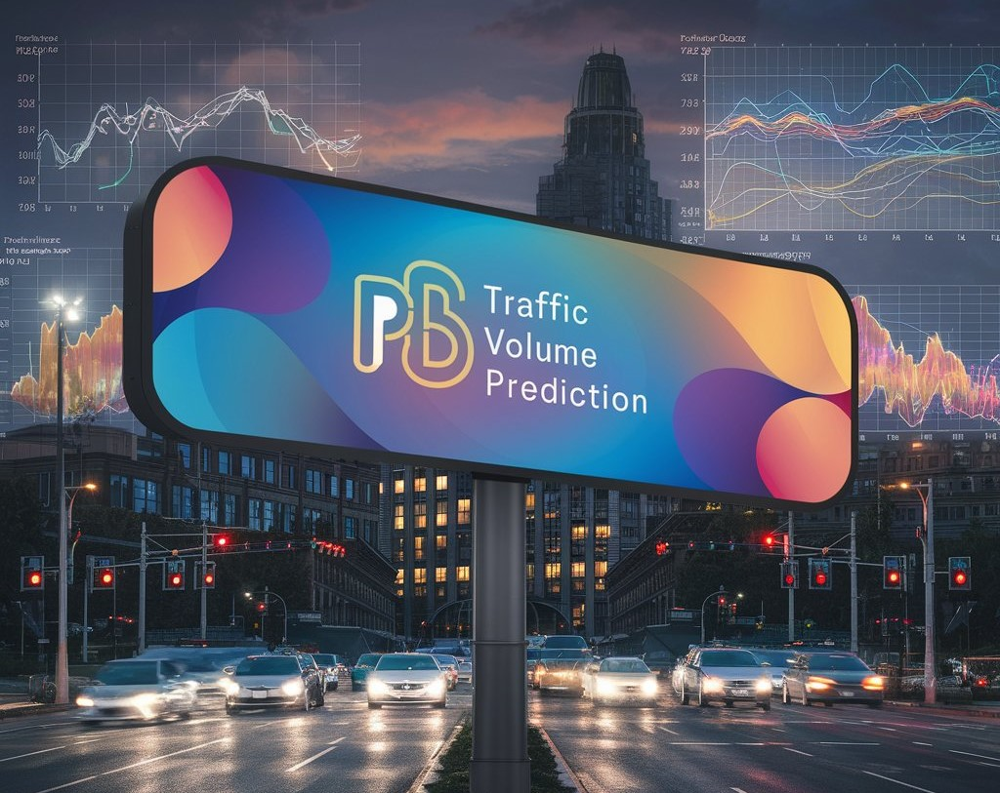
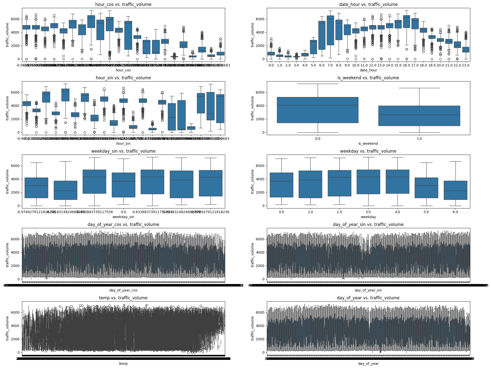
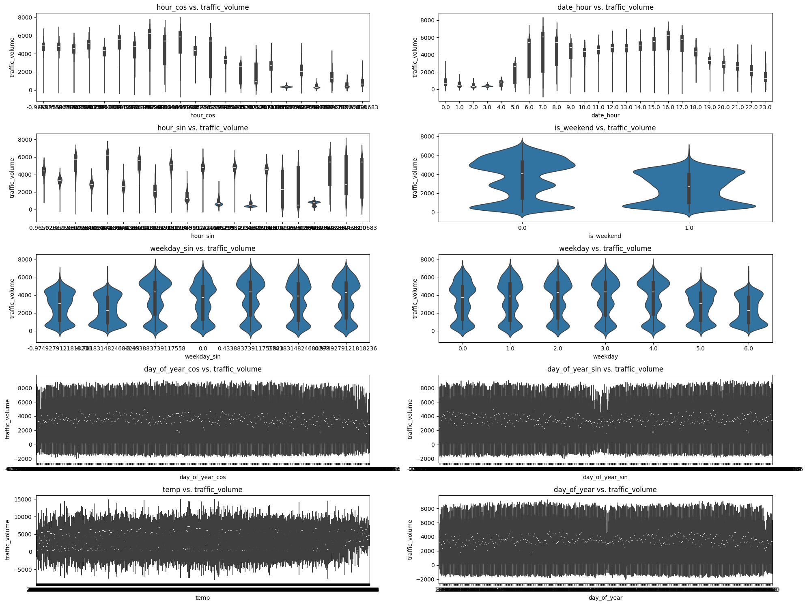

# Traffic Volume Prediction


In collaboration with Institute 123 of AI, a Kaggle hackathon competition was organized among the students of the February 2024 cohort. The competition, which commenced on April 9th, 2024, and concluded on April 14th, 2024, provided an exceptional learning opportunity for participants to delve into the realm of traffic volume prediction.

Participants were tasked with retrieving traffic volume data for the test dataset by meticulously training their models on the provided train data. The competition journey encompassed a comprehensive array of tasks, including data cleaning, exploratory data analysis, feature engineering, feature selection, model fitting, and prediction.

Throughout the competition, participants engaged in rigorous data preprocessing to ensure the integrity and quality of the dataset. This involved handling missing values, addressing outliers, and standardizing data formats. Additionally, exploratory data analysis techniques were employed to gain insights into the underlying patterns and trends within the dataset.

Feature engineering played a pivotal role in enhancing the predictive capabilities of the models. Participants creatively engineered new features from the existing data, leveraging domain knowledge and innovative techniques to extract relevant information for predicting traffic volume accurately.

The process of feature selection involved identifying the most influential predictors and eliminating redundant or irrelevant features to streamline the model training process. Participants employed various methodologies, including statistical tests, correlation analysis, and model-based feature selection techniques, to identify the optimal feature subset.

Model fitting constituted a significant portion of the competition, wherein participants explored a diverse range of machine learning algorithms, ranging from traditional regression models to sophisticated ensemble methods and neural networks. Hyperparameter tuning techniques were employed to optimize model performance and achieve superior predictive accuracy.

The culmination of the competition involved leveraging the trained models to predict traffic volume for the test dataset accurately. Participants employed robust evaluation metrics to assess the performance of their models, ensuring robustness and generalizability.

Overall, the Kaggle hackathon competition proved to be a remarkable learning experience, providing participants with hands-on exposure to real-world data science challenges in the domain of traffic volume prediction. Through collaborative efforts and innovative methodologies, participants showcased their prowess in data analysis, modeling, and predictive analytics, exemplifying the spirit of continuous learning and exploration in the field of artificial intelligence and machine learning.

## Implementation Details

- Dataset: Traffic Volume Prediction (view below for more details)
- Input: 8 features - holiday ,temp ,rain_1h, snow_1h, ...
- Output: Traffic volume on test data 

## Dataset Details

This dataset was obtained from the UCI Machine Learning Repository ([Link](www.kaggle.com/competitions/123ofai-predict-the-traffic-volume/overview/citations))

-Files
-train_set_dirty.csv - the training set with input features and GT value for 'traffic_volume'
-test_set_nogt.csv - the test set with only input features to evaluate your model (from which you shall generate the output file)
-sample_submission.csv - a sample submission file in the expected format
-Columns
-holiday: a categorical variable that indicates whether the date is a US national holiday or a regional holiday (such as the Minnesota State Fair).
-temp: a numeric variable that shows the average temperature in kelvin.
-rain_1h: a numeric variable that shows the amount of rain in mm that occurred in the hour.
-snow_1h: a numeric variable that shows the amount of snow in mm that occurred in the hour.
-clouds_all: a numeric variable that shows the percentage of cloud cover.
-weather_main: a categorical variable that gives a short textual description of the current weather (such as Clear, Clouds, Rain, etc.).
-weather_description: a categorical variable that gives a longer textual description of the current weather (such as light rain, overcast clouds, etc.).
-date_time: a DateTime variable that shows the hour of the data collected in local CST time.
-traffic_volume: a numeric variable that shows the hourly I-94 reported westbound traffic volume.


## Evaluation and Results

- metric used to evaluate the model performace is Mean squared error 
| Model                                                                   | Metric (MSE) |
|-------------------------------------------------------------------------|--------------|
| Feature selection: Randomforestregressor, model: XGboostregressor       | 87737.047    |
       


-Leader board screenshot  


in above table it is clearly understood that Xgboost model with Gridsearchcv hypertuning and randomforest feature selection method combined gives a decent results, although it is understood that further preprocessing and iternations of further model evaluations will improve the score.

shown below are certain visualization gatherd from the project 

-scatter plot of selected features to traffic volume 


-boxplot of selected features to traffic volume



-violin plot of selected features to traffic volume



-histogram of selected features 


-pairplot of selected features and traffic volume 


## Key Takeaways

-In predictive modeling tasks, particularly with categorical features such as datetime, leveraging advanced algorithms like XGBoostRegressor has shown remarkable efficacy. However, the success of these models heavily relies on the adept extraction of meaningful information from the available features.

-One pivotal aspect of this journey lies in feature extraction, where the datetime feature stands as a significant challenge. Directly utilizing the raw datetime feature often proves inadequate, necessitating sophisticated encoding techniques for optimal model performance.

-Cyclic encoding of datetime not only enhances model interpretability but also unlocks latent temporal patterns inherent in the data. By transforming datetime into cyclical representations, valuable temporal information is preserved, enabling the model to capture periodic trends and seasonal variations effectively.

-Furthermore, the process of one-hot encoding categorical features poses additional complexities, particularly when transitioning from training to testing datasets. Variations in unique values between the two datasets can lead to discrepancies, potentially hindering model generalization.

-Navigating these challenges demands a meticulous approach, encompassing feature engineering techniques tailored to the nuances of the dataset. Successful model development hinges on the adept extraction and encoding of features, ensuring that valuable information is effectively harnessed to drive predictive performance and robustness across diverse datasets.

## How to Run

The code is built on Google Colab on an iPython Notebook. 

```bash
Simply download the repository, upload the notebook and dataset on colab, and hit play!
```


## Roadmap

What are the future modification you plan on making to this project?

- i would like to achive better MSE score by adding more feature selection methods.

## Libraries 

**Language:** Python

**Packages:** Sklearn, Matplotlib, numpy, Pandas, Seaborn

## FAQ

#### Question 1 : what i did in preprocessing  ?

-Data Formatting and Feature Extraction:

The initial step involved converting the 'date_time' column from a string format to a datetime format using the pd.to_datetime function.
Subsequently, cyclic features such as 'date_month_no', 'date_day', 'date_hour', 'weekday', and 'is_weekend' were extracted from the 'date_time' column using the dt accessor in pandas.
Additionally, cyclic transformations were applied to these features to capture periodic patterns such as hourly, daily, weekly, and monthly variations using sine and cosine transformations.

-Handling Missing Values:

Missing values in numerical features were addressed using appropriate strategies:
For the 'temp' column, missing values were filled with the mean temperature.
Linear interpolation was applied to fill missing values in the 'rain_1h' and 'snow_1h' columns to ensure a smooth transition between existing data points.
Missing values in the 'clouds_all' column were filled with the mean cloud coverage.
Rows containing missing values in critical columns such as 'traffic_volume', 'weather_main', 'weather_description', and 'date_time' were dropped to maintain data integrity and avoid bias in subsequent analyses.

-Feature Engineering:

Redundant or non-contributing features such as the 'holiday' column were dropped from the dataset.
One-hot encoding was performed on categorical variables like 'weather_main' and 'weather_description' to represent them as binary vectors, facilitating their utilization in machine learning algorithms.

-Handling Inconsistencies between Train and Test Data:

To address potential inconsistencies between unique values in the train and test datasets, specific categories in the 'weather_description' column that were present only in the training data were identified and subsequently dropped from the dataset. This ensures model robustness and prevents errors during inference on unseen data.

-Data Cleansing and Validation:

Duplicate rows were removed from the dataset to maintain data quality and prevent redundancy.
A thorough inspection of the dataframe structure was conducted to verify the absence of any remaining missing values, ensuring the dataset's readiness for subsequent analysis.

-Exploratory Data Analysis (EDA):

Following preprocessing, the prepared dataset was subjected to exploratory data analysis, including visualizations and statistical analyses, to gain insights into the underlying patterns and relationships within the data.

#### Question 2 : which method gave the best output comparatively for this dataset

- After meticulously exploring various modeling techniques, including linear regression, support vector regression (SVR), neural networks, k-nearest neighbors (KNN), and LightGBM, I arrived at a noteworthy performance level using XGBoost.

-The process involved a structured approach, beginning with feature selection using Random Forest, followed by model training and prediction with XGBoost. To further refine the model and optimize its parameters, I employed GridSearchCV for hyperparameter tuning. This exhaustive search over the hyperparameter space allowed for the identification of the most effective configuration for the XGBoost model.

-Subsequently, the model's performance was rigorously evaluated using appropriate metrics, ensuring robustness and reliability. Through this iterative process of experimentation and validation, the combination of feature selection with Random Forest, followed by XGBoost modeling and hyperparameter tuning, emerged as the most successful approach in achieving the desired predictive accuracy.

-In conclusion, the comprehensive methodology employed, coupled with the strategic utilization of advanced techniques such as feature selection and hyperparameter optimization, culminated in a high-performing predictive model tailored to the specific requirements of the task at hand.


## Contact

If you have any feedback/are interested in collaborating, please reach out to me at [](https://www.linkedin.com/in/kartikey-vyas-2a29b9273) &nbsp; <a href="mailto:kvsvyas@gmail.com"> 


## License

[MIT](https://choosealicense.com/licenses/mit/)

